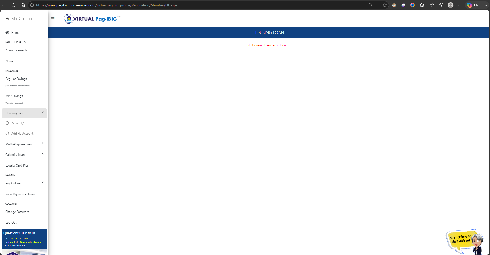

# 01 — Research

## 1.1 Heuristic Evaluation

This is based on a **full walkthrough of the live website** (17 screens, `pagibigfundservices.com`) plus the mobile app (7 screens). Screenshots are in `assets/screenshots-before/`.

**Confirmed site facts (from direct testing, not assumption):**
- The **"Pay Online" form is a single reusable template** — Regular Savings, MP2 Savings, Housing Loan, Housing Loan Processing, Multi-Purpose Loan, Calamity Loan, and Advance Insurance all route through the same layout, differing only by a "Program Type" selection. Good reuse pattern to preserve in the redesign — but see issue #16 below.
- **There is no Account/Profile information page anywhere on the website.** The mobile app has one (Account Details screen); the website does not. This is a cross-platform parity gap.
- **Logging out returns the user straight to the public homepage/login screen (`Default.aspx`)** with no confirmation, no "you've been logged out" message.

### Full Issue Log

| # | Issue | Screenshot(s) | Nielsen Heuristic Violated |
|---|---|---|---|
| 1 | Nearly every inner page renders content in a small fixed-width block top-left, leaving 70–85% of the screen as blank white space | `web-03-announcements`, `web-04-news`, `web-07-housing-loan-empty`, `web-08-housing-loan-add-account`, `web-09-mpl-empty`, `web-11-calamity-empty`, `web-13-loyalty-empty`, `web-16-view-payments`, `web-17-change-password` | Aesthetic and minimalist design — the single most consistent structural problem on the site |
| 2 | Duplicated, redundant error messaging: an inline error AND a modal popup fire for the same failure, with awkward phrasing ("Minimal error is being encountered") | `web-06-mp2-error` | Help users recognize, diagnose, and recover from errors |
| 3 | Inconsistent empty-state treatment across functionally identical situations: Housing Loan and MPL "View" show plain red text with no next step, while MPL/Calamity "Filing" pages and Loyalty Card Plus pair the same empty state with a clear action button | `web-07-housing-loan-empty` vs. `web-10-mpl-filing`, `web-12-calamity-filing`, `web-13-loyalty-empty` | Consistency and standards |
| 4 | No Account/Profile page exists on the website at all, despite one existing in the mobile app | Site-wide (confirmed via navigation) | Consistency and standards (cross-platform parity) |
| 5 | Logout returns directly to the public homepage with no confirmation or session-ended feedback | `web-01-login-landing` (destination after logout) | Visibility of system status |
| 6 | Full MID number and mobile number shown in plaintext, no masking | `app-03-account`, `app-06-savings`, `web-05-regular-savings`, `web-16-view-payments` | Error prevention / security |
| 7 | "Last failed login" shown prominently right after a successful login | `web-02-home`, `app-03-account` | Match between system and real world |
| 8 | Internal version number exposed to end users ("v1.9.1", "2.0.2") | `web-01-login-landing`, `web-02-home`, `app-01-splash` | Aesthetic and minimalist design |
| 9 | Floating chatbot avatar overlaps page content on every web screen, plus a static photo thumbnail beneath it that adds visual noise without function | All `web-*` screenshots | Aesthetic and minimalist design / user control |
| 10 | Read-only data (Initial Remittance Date, Total Employee Share, etc.) styled inside gray boxes that look like disabled input fields | `web-05-regular-savings`, `web-16-view-payments`, `app-06-savings` | Consistency and standards — affordance mismatch |
| 11 | Truncated/cut-off announcement text on the app dashboard | `app-04-dashboard` | Error prevention |
| 12 | Bottom nav icons with no visible labels (app) | `app-03` through `app-07` | Recognition rather than recall |
| 13 | Login page: phone number "8-PAG-IBIG (8-724-4244)" rendered as a stylized graphic directly on top of the hero photo, overlapping the model's hand/chest — very hard to read | `web-01-login-landing` | Aesthetic and minimalist design / legibility |
| 14 | Login form panel floats on top of and partially obscures the hero photo | `web-01-login-landing` | Aesthetic and minimalist design |
| 15 | Footer navigation has two separate link columns both labeled "BROWSE OUR WEBSITE" — no distinguishing header | `web-01-login-landing` | Match between system and real world / recognition |
| 16 | Pay Online form reuses one template across 7 program types, differentiated only by a dropdown/sidebar radio label — no strong visual confirmation of what's being paid for before submission, risking misdirected payments | `web-15-pay-online` | Error prevention |
| 17 | Password Change screen shows the rules as a static bullet list rather than live validation as the user types, and has no show/hide toggle on password fields | `web-17-change-password` | Visibility of system status |
| 18 | Sidebar and page-header both restate the page title, but the sidebar's active-state highlighting is subtle (light gray) and easy to miss, especially on nested items like "Housing Loan → Account/s" | `web-06` through `web-14` | Recognition rather than recall |

Add screenshots into this doc using standard markdown image syntax once referenced, e.g.:
```markdown

```

---

## 1.2 Secondary Research

Summarize each source in 2–3 sentences, your own words, with the link:

1. **Google Play Store reviews** — search "Virtual Pag-IBIG" on Google Play, read the 1–2 star reviews (app crashing on open, generic login errors, password reset not recognizing existing accounts).
2. **Respicio & Co. — Pag-IBIG posting errors** — https://www.respicio.ph/commentaries/how-to-resolve-pag-ibig-online-system-and-posting-errors — directly evidenced by the MP2 Savings error state you captured (issue #2 above).
3. **Respicio & Co. — account recovery** — https://www.lawyer-philippines.com/articles/76dzd0gdc3egdzduc62t366iu1qecz
4. **ARTA complaint rankings** — most recent Top 10 Most Complained GOCCs report.

---

## 1.3 Primary Research (lightweight)

Interview 3–5 people, ideally: one employed private-sector member, one OFW/voluntary member, one person who has applied for a loan.

**Script:**
1. "Walk me through the last time you checked your Pag-IBIG savings or loan status — web or app?"
2. "Did anything on screen make you unsure or worried?"
3. "Have you ever needed to apply for a loan or fix a contribution issue? What was that like?"
4. "Do you use the app or the website more? Why?"
5. "Was there a moment you didn't know what to do next?"
6. "Have you ever tried to check MP2 savings and gotten an error? What did you do next?"
7. "Did you know there's no way to view your account/profile details on the website? Would that be useful to you?"

If you can't get real interviews, clearly label your findings as **"synthesized from secondary research and heuristic evaluation"** — never present invented interviews as real.

---

## 1.4 Affinity Mapping

1. Open FigJam → new file → `Pag-IBIG Research Synthesis`
2. One sticky note per finding (18 heuristic issues + interview findings). Color code: 🟥 red = trust/security issue, 🟦 blue = navigation/layout issue, 🟩 green = task-completion/error issue, 🟨 yellow = visual inconsistency
3. Cluster into groups, name each cluster
4. Export as PNG, save to `assets/`

Expected clusters:
- **Wasted Space & Layout Inconsistency** (issue #1 alone spans 9+ screens — likely your largest cluster)
- **Trust & Security Anxiety** (#6, #7, #8)
- **Broken/Confusing Error Handling** (#2, #11, #16)
- **Inconsistent Empty States & Navigation** (#3, #15, #18)
- **Missing Feature Parity** (#4 — no web account page)
- **Abrupt System Transitions** (#5)
